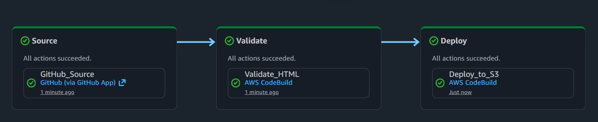

# AWS Personal Portfolio

Personal portfolio site with full cloud infrastructure and automated CI/CD — built to be fully reproducible from code.

## Overview

This project covers everything from the static front-end to the cloud infrastructure and release pipeline:

- **Site** — single-file `index.html` portfolio with an introduction, skills, and project showcase
- **Infrastructure** — AWS resources provisioned with Terraform (S3, CloudFront, ACM)
- **Pipeline** — automated deployments via AWS CodePipeline connected to this Git repository

Every push to the main branch triggers a full deployment with no manual steps.

## Architecture


## Tech Stack

| Layer | Technology |
|---|---|
| Frontend | HTML, CSS, JavaScript |
| Hosting | AWS S3 (static website) |
| CDN | AWS CloudFront |
| TLS Certificate | AWS ACM |
| Infrastructure as Code | Terraform |
| CI/CD | AWS CodePipeline + CodeBuild |
| Source Connection | AWS CodeConnections (GitHub) |

## Infrastructure

All AWS resources are managed by Terraform under the `terraform/` directory.

```
terraform/
├── main.tf          # S3 bucket, CloudFront distribution, ACM certificate
├── pipeline.tf      # CodePipeline, CodeBuild, CodeConnections
├── variables.tf
└── outputs.tf
```

### Deploy infrastructure

```bash
cd terraform
terraform init
terraform plan
terraform apply
```

> **Note:** ACM certificates for CloudFront must be provisioned in `us-east-1` regardless of your primary region.

## CI/CD Pipeline

The pipeline is triggered automatically on every push to `main`:

1. **Source** — CodePipeline pulls the latest commit via the GitHub CodeConnections integration
2. **Test** — CodeBuild runs an HTML validation check against `index.html`; the pipeline halts if the file is malformed
3. **Build** — CodeBuild syncs the site files to the S3 bucket
4. **Invalidate** — CloudFront cache is invalidated so changes go live immediately

